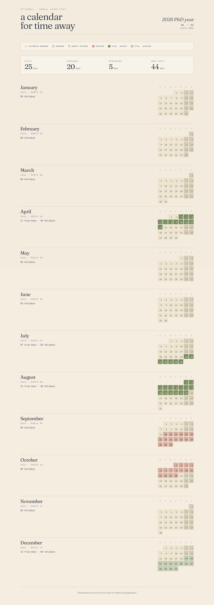
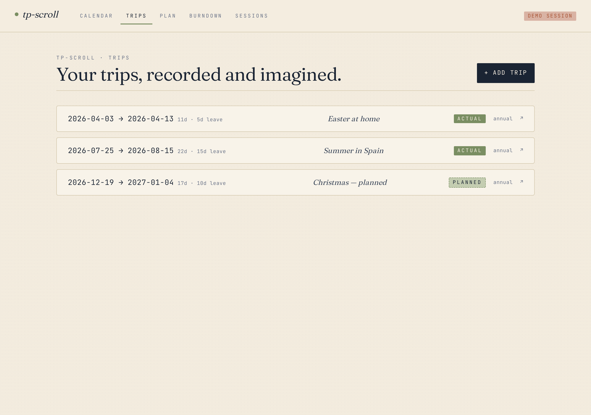
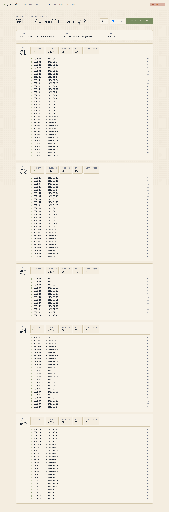
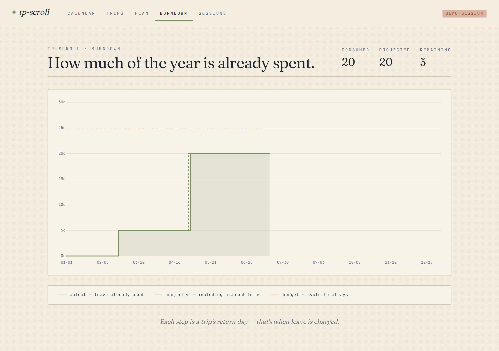
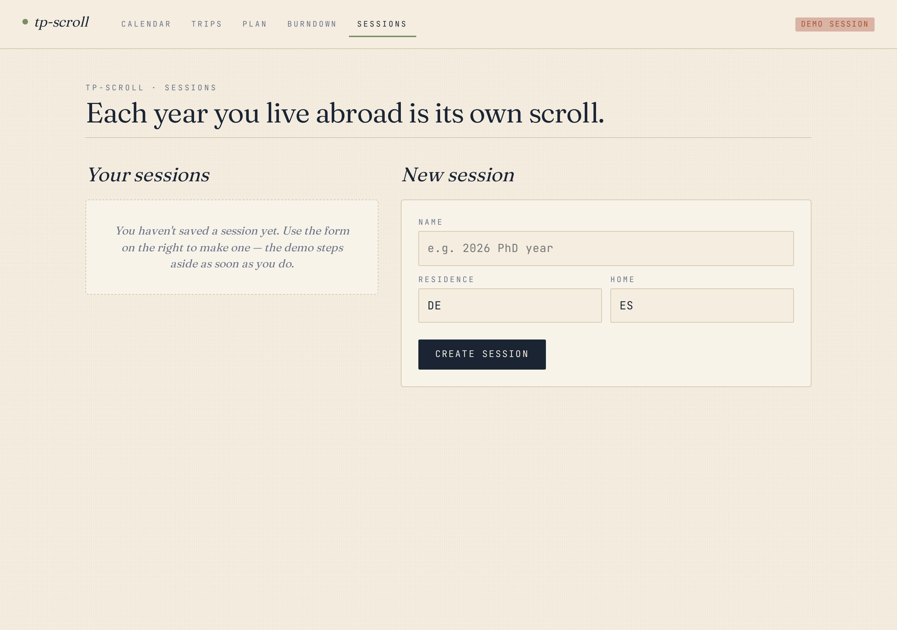

# Screenshots

Snapshots of the desktop UI on the demo session (residence: DE, home: ES, 2026 cycle).

## Calendar grid

The page-1 view — masthead, legend, summary row, and twelve mini-month grids. Trips in sage, holidays in muted gold, blocked periods hatched in faded red.

## Trips

CRUD list of trips with dates, italic notes, ACTUAL / PLANNED chips, and bucket labels.

## Plan

Top-K plans from the optimizer with per-plan score chips (home days, leverage, anchors, trip count, leave used) and trip mini-lists. The `--diverse` toggle pulls in multi-seed search results across the year.

## Burndown

Cumulative leave-cost over the cycle. Solid sage = actuals, dashed sage = projected, dotted red = budget.

## Sessions

Two-column layout for managing sessions: list + switch + delete on the left, new-session form + cycle-roll on the right.

